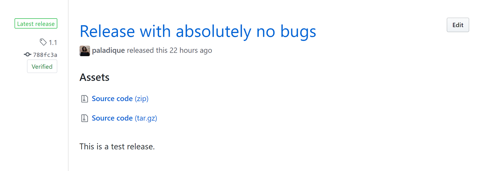
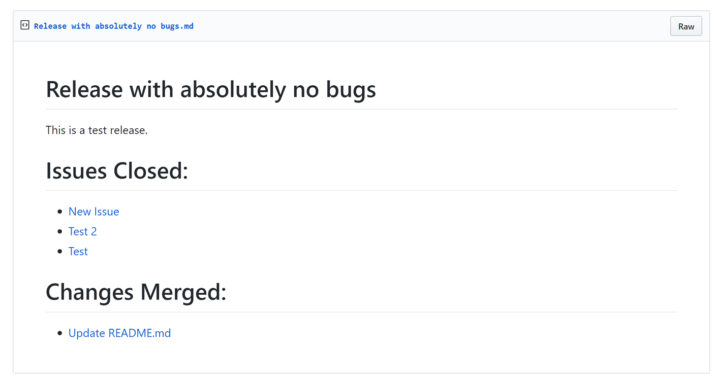
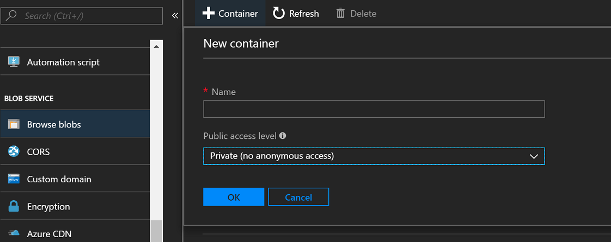
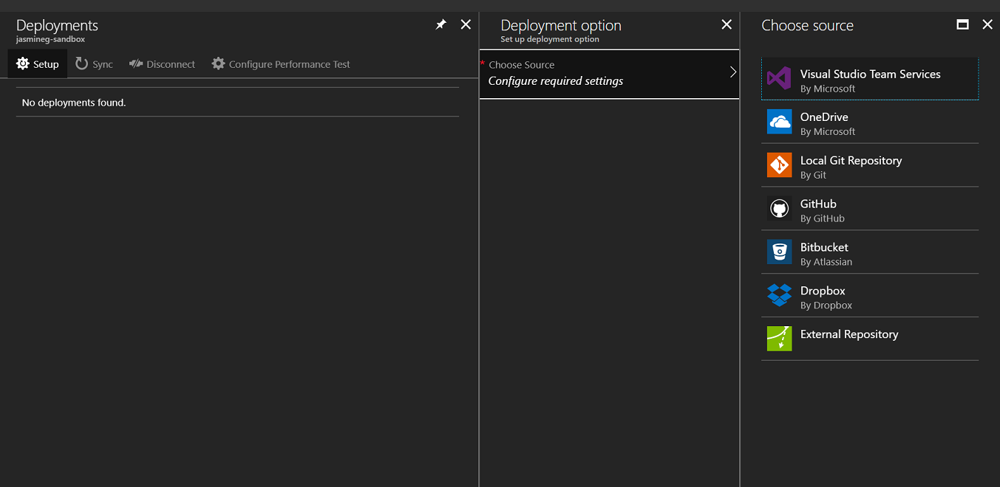
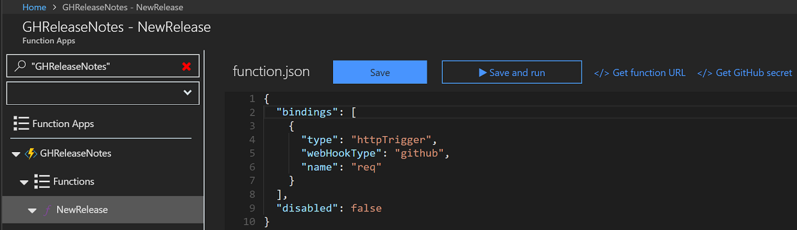
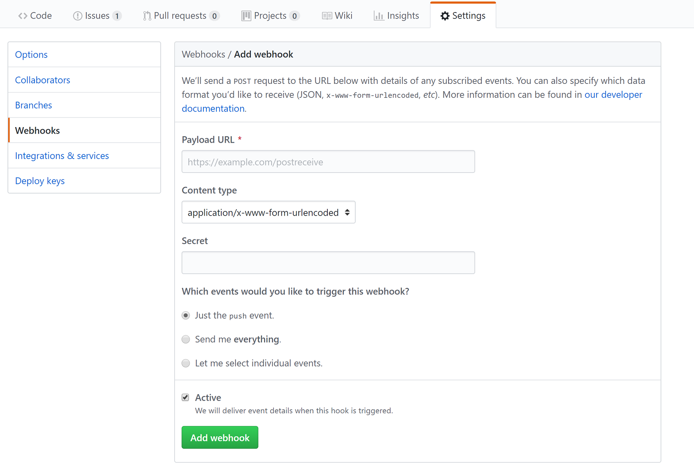
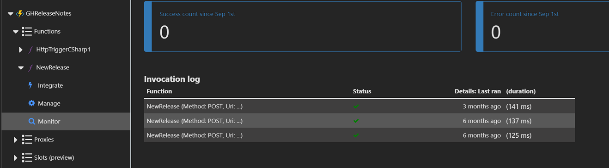
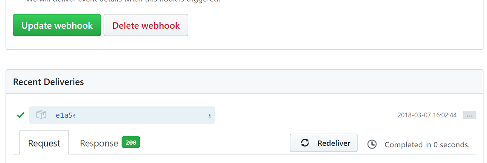

# GitHub Release Notes Generator
A serverless tool for generating a release notes document for projects hosted on GitHub.

## Features

_Example release on GitHub_

_Rendered markdown file of example release notes_

The generator is a [function app](https://docs.microsoft.com/en-us/azure/azure-functions/functions-overview?WT.mc_id=demo-functions-jasmineg) containing a [GitHub webhook](https://docs.microsoft.com/en-us/azure/azure-functions/functions-create-github-webhook-triggered-function?WT.mc_id=demo-functions-jasmineg) function that creates a Markdown file whenever a new release is created, using [Azure Blob Storage](https://azure.microsoft.com/en-us/services/storage/blobs?WT.mc_id=demo-functions-jasmineg).

## Prerequisites

- [Azure](https://azure.microsoft.com/en-us/free?WT.mc_id=demo-functions-jasmineg) account.
- [GitHub](https://github.com/join) account with an active repository.

### Portal Quickstart

The following tutorial shows how to set up the function app from a forked version of the repository in the Azure Portal:

#### Create a Blob Container

 1. Follow the first two sections of the following walkthrough on how to [create a container](https://docs.microsoft.com/en-us/azure/storage/blobs/storage-quickstart-blobs-portal?WT.mc_id=demo-functions-jasmineg). Name the container `releases`
 2. In the storage account menu, navigate to **Access keys** and copy the connection string for this field. Save for later.

#### Deploy from a Forked GitHub Repository
1. Create a new function app. See section on how to [create a function app](https://docs.microsoft.com/en-us/azure/azure-functions/functions-create-first-azure-function#create-a-function-app?WT.mc_id=demo-functions-jasmineg) to get started.

2. In the **Platform features** tab, select **Deployment Options** and select **Setup** to set the deployment source.
3. Choose GitHub in the **Choose Source** menu. After following the authentication instructions, point the deployment source to the forked repository.
4. After it's been created, go to the new function app's Overview menu, click and open **Application settings**, scroll to and click **+ Add new setting**. Name the setting `StorageAccountConnectionString` and paste the copied connection string into the value field. Click **Save**
5. In the same function app, go to **Function app settings** and change the runtime version to 2 if not already set.
6. The the same function app settings, copy the default host key buy selecting the copy action and save for later.

7. In the `New Release` function, copy the url by clicking **</> Get function URL** and save for later. Repeat for **</> Get GitHub secret**.

#### Configure GitHub Webhook
1. In GitHub, select the repository to use with webhook. Navgiate to the repository's settings.

2. In the menu on the left of the repository settings, select webhooks and click **add a webhook** button.
3. Follow the table to configure your settings:

| Setting | Suggested value | Description |
|---|---|---|
| **Payload URL** | Copied values | Use the value returned by  **</> Get function URL** and the default host key so that it reads `https://functionappname.azurewebsites.net/api/NewRelease?code=[host key]` |
| **Content type** | application/json | The function expects a JSON payload. |
| **Secret**   | Copied value | Use the value returned by  **</> Get GitHub secret**. |
| **Event triggers** | Let me select individual events | We only want to trigger on release events.  |

1. Click **add webhook**.
2. Go to your GitHub user settings, then to **Developer Settings** > [Personal Access Tokens](https://github.com/settings/tokens) > **Generate New Token**. Give this token a name and copy the token. [Instructions on creating a Personal Access Token on GitHub](https://help.github.com/articles/creating-a-personal-access-token-for-the-command-line/).
3. Go back to the portal and to the function app **Application settings**, scroll to and click **+Add new setting**. Name the setting `ReleaseNotesAppToken` and paste the copied token into the value field.

### Using "Deploy to Azure"
Click the "Deploy to Azure" button above to replicate the services used in this sample on your Azure subscription. This requires an additonal step of filling out the relevant configuration settings.

**Storage Account Connection String** You'll need a storage account with a blob container called `releases`. Follow the first two sections of the following walkthrough on how to [create a container](https://docs.microsoft.com/en-us/azure/storage/blobs/storage-quickstart-blobs-portal?WT.mc_id=demo-functions-jasmineg). In the storage account menu, navigate to **Access keys** and copy the connection string for this field.

**GitHub App Token** From your GitHub user settings, go to  **Developer Settings** > [Personal Access Tokens](https://github.com/settings/tokens) > **Generate New Token**. Give this token a description then copy and paste the generated token into this field. [Instructions on creating a Personal Access Token on GitHub](https://help.github.com/articles/creating-a-personal-access-token-for-the-command-line/).

### Test the application

Create a new release in the repository. Fill out the required fields and click **Publish release**. The generated blob will be a markdown file named as the release title.

_Monitor and review the functions' execution history in the **Monitor** context menu of the function._

_To run the function again without creating another release, go to the configured webhook in GitHub to redeliver it._

## Resources
- [Introduction to Azure Functions](https://docs.microsoft.com/en-us/azure/azure-functions/functions-overview?WT.mc_id=demo-functions-jasmineg)
- [Azure Functions triggers and bindings concepts](https://docs.microsoft.com/en-us/azure/azure-functions/functions-triggers-bindings?WT.mc_id=demo-functions-jasmineg)
- [Azure Functions C# script (.csx) developer reference](https://docs.microsoft.com/en-us/azure/azure-functions/functions-reference-csharp?WT.mc_id=demo-functions-jasmineg)
- [Octokit.NET](https://octokit.github.io/)
