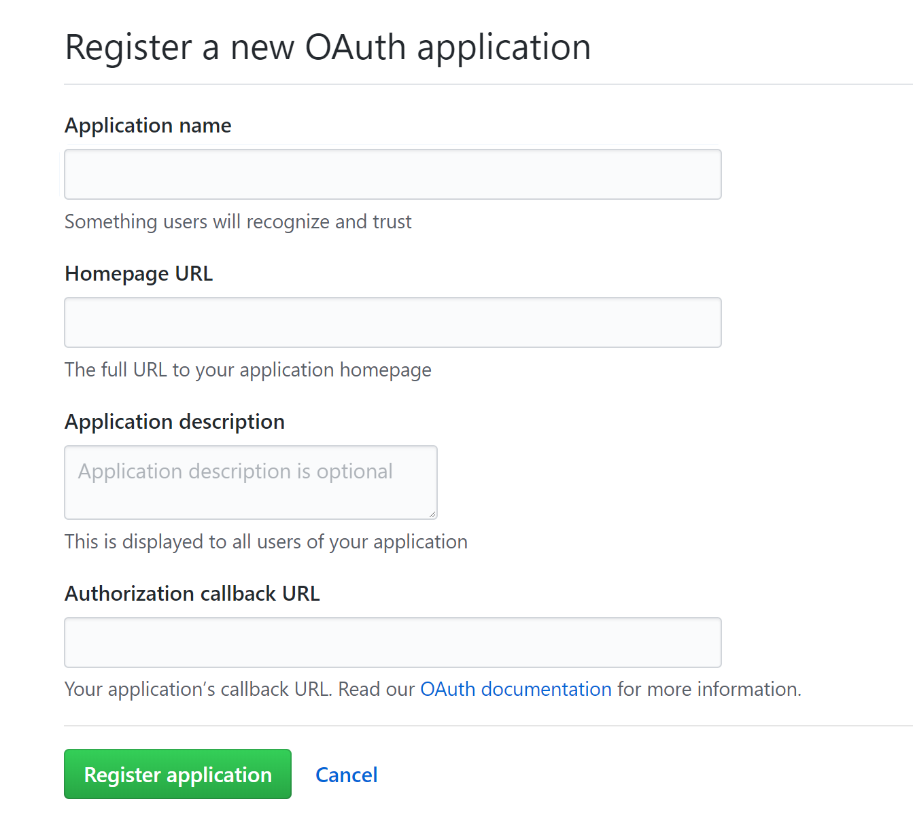

# GitHub Release Notes Generator
A serverless tool for generating a release notes document for projects hosted on GitHub.

## Features

_Example release on GitHub_

_Rendered markdown file of example release notes_

The generator is a [function app](https://docs.microsoft.com/en-us/azure/azure-functions/functions-overview?WT.mc_id=demo-functions-jasmineg) containing a [GitHub webhook](https://docs.microsoft.com/en-us/azure/azure-functions/functions-create-github-webhook-triggered-function?WT.mc_id=demo-functions-jasmineg) function that creates a Markdown file whenever a new release is created, using [Azure Blob Storage](https://azure.microsoft.com/en-us/services/storage/blobs?WT.mc_id=demo-functions-jasmineg).

### Prerequisites

- [Azure](https://azure.microsoft.com/en-us/free?WT.mc_id=demo-functions-jasmineg) account.
- [GitHub](https://github.com/join) account with an active repository.

## Portal Quickstart

The following tutorial shows how to set up the function app from the Azure Portal:

### Create a Blob Container

1. Navigate to the Azure Portal and create a storage account. See the [Create a storage account quickstart](https://docs.microsoft.com/en-us/azure/storage/common/storage-quickstart-create-account?tabs=portal#create-a-general-purpose-storage-account?WT.mc_id=demo-functions-jasmineg) to get started. 
2. Navigate to the new storage account, navigate to the **Blob Service** section, select **Browse Blobs**, then click the **Add Container** button at the top to create a blob container named `releases`. See section on how to [create a container](https://docs.microsoft.com/en-us/azure/storage/blobs/storage-quickstart-blobs-portal#create-a-container?WT.mc_id=demo-functions-jasmineg) for more information.
3. In the same storage account menu, navigate to **Access keys** and copy the connection string.

### Create and Configure a GitHub Webhook Triggered Function
1. Create a function app. See section on how to [create a function app](https://docs.microsoft.com/en-us/azure/azure-functions/functions-create-first-azure-function#create-a-function-app?WT.mc_id=demo-functions-jasmineg) to get started.
2. Navigate to the new function, from the overview, click and open **Application settings**, scroll to and click **+ Add new setting**. Name the setting `StorageAccountConnectionString` and paste the copied connection string into the value field. Click **Save**
3. In the function app, add a C# GitHub webhook function. See section on how to [Create a GitHub webhook triggered function](https://docs.microsoft.com/en-us/azure/azure-functions/functions-create-github-webhook-triggered-function#create-a-github-webhook-triggered-function?WT.mc_id=demo-functions-jasmineg) to get started.

4. Replace starter code with code from `NewRelease.cs`
5. Replace contents of (or upload) `project.json` with this projects' project.json

6. In your new function, copy the url by clicking click **</> Get function URL**, and save for later. Repeat for **</> Get GitHub secret**. You will use these values to configure the webhook in GitHub.

### Configure GitHub Webhook
1. Navigate to GitHub and select the repository to use with webhook. Navgiate to the repository's settings.

2. In the menu on the left of the repository settings, select webhooks and click **add a webhook** button.
3. Follow the table to configure your settings:

| Setting | Suggested value | Description |
|---|---|---|
| **Payload URL** | Copied value | Use the value returned by  **</> Get function URL**. |
| **Content type** | application/json | The function expects a JSON payload. |
| **Secret**   | Copied value | Use the value returned by  **</> Get GitHub secret**. |
| **Event triggers** | Let me select individual events | We only want to trigger on release events.  |

4. Click **add webhook**.

5. Navigate to your GitHub user settings, then to **Developer Applications**. Click **New OAuth App** and create an app with a homepage url and callback url of your choice, as they will not be used in the app. Copy and save the application name for later use.
6. Go back to the portal and to the function app **Application settings**, scroll to and click **+ Add new setting**. Name the setting `ReleaseNotes` and paste the copied GitHub OAuth App name into the value field. Click **Save**.

## Using "Deploy to Azure"
Click the "Deploy to Azure" button above to replicate the services used in this sample on your Azure subscription. This requires an additonal step of filling out the relevant configuration settings.

**Storage Account Connection String** You'll need a storage account with a blob container called `releases`. Follow the first two sections of the following walkthrough on how to [create a container](https://docs.microsoft.com/en-us/azure/storage/blobs/storage-quickstart-blobs-portal?WT.mc_id=demo-functions-jasmineg). In the storage account menu, navigate to **Access keys** and copy the connection string for this field.

**GitHub App Name** [Create an OAuth App on Github](https://developer.github.com/apps/building-oauth-apps/creating-an-oauth-app/). Paste the App name into this field.

### Test the application

Create a new release in the repository. Fill out the required fields and click **Publish release**. The generated blob will be a markdown file named as the release title.

_Monitor and review the functions' execution history in the **Monitor** context menu of the function._

_To run the function again without creating another release, go to the configured webhook in GitHub to redeliver it._

## Resources
- [Introduction to Azure Functions](https://docs.microsoft.com/en-us/azure/azure-functions/functions-overview?WT.mc_id=demo-functions-jasmineg)
- [Azure Functions triggers and bindings concepts](https://docs.microsoft.com/en-us/azure/azure-functions/functions-triggers-bindings?WT.mc_id=demo-functions-jasmineg)
- [Azure Functions C# script (.csx) developer reference](https://docs.microsoft.com/en-us/azure/azure-functions/functions-reference-csharp?WT.mc_id=demo-functions-jasmineg)
- [OctoKit.NET](https://octokit.github.io/)
